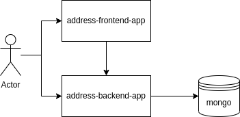

# k8s-poc
Kubernetes study


## The porpuses of this POC
- connect docker containers from each other with docker-compose and k8s services
- expose applications using ingress
- how to work with replica set with k8s

## Architecture
To test the concepts behind kubernetes features were created the following projects:
- address-frontend-app  (an interface to created, edit and list addresses)
- address-backend-app   (an API where frontend-app above will connect to)
- mongodb               (a database to store addresses data from backend-app above)





## Mongodb run docker command
```
docker run -d -p 27017:27017 -v ~/data/mongo:/data/db --name mongodb-k8s mongo:latest
```

## Start frontend from Dockerfile
(go to front root directory)
```
docker build -t k8sfront .
docker run -p 3000:3000 -v /app/node_modules -v $(pwd):/app k8sfront
```

## Start backend from Dockerfile
(go to backend root directory)
```
docker build -t k8sback .
docker run -p 3001:3001 -v /app/node_modules -v $(pwd):/app k8sback
```

## Start docker-compose
```
docker-compose down && docker-compose build --no-cache && docker-compose up
```
